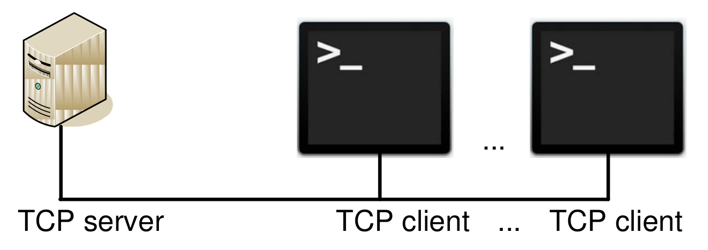
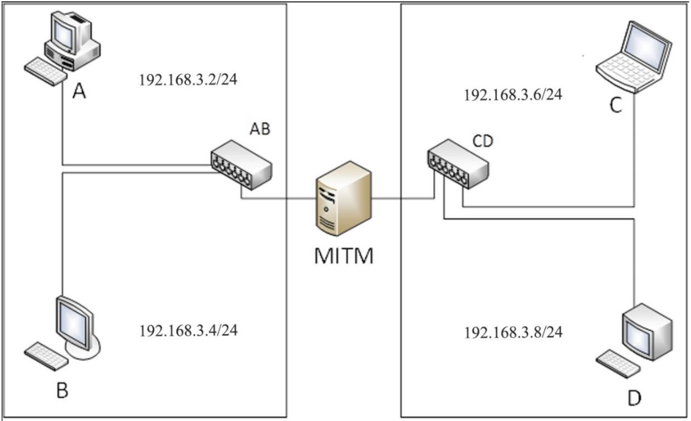

# File sharing network

## Overview
### Task №1 (P2P файлообменная сеть):

#### Общее описание задачи:

Разработка клиент-серверного приложения предполагает одновременное множественное подключение клиентов к серверу.



Разработка серверной части должна быть проведена 2 способами:
- на языке С/С++ c использованием потоков
- c использованием одной из неблокирующих (асинхронных) технологий с циклом ожидания событий и callback функциями:
libUV, nodeJS, асинхронные библиотеки Python, С#, Java, Go, Rust ...

Разработка клиентской части может быть проведена при помощи
любой удобной технологии.

#### Задача из варианта:

Клиенты подключаются к серверу по протоколу TCP, после подключения
они автоматически отправляют на сервер хранилище имен
общих файлов (хранящихся в той же папке), а также хэши для
содержимого этих файлов. Если содержимое файлов совпадает,
их хэши совпадают, и сервер сохраняет хранилище уникальных файлов в
сети.

Клиент может запросить хранилище файлов, совместно используемых в сети
, и начать загрузку любого из них через сервер. Если
один и тот же загруженный файл находится на 2 или более клиентах,
загрузка осуществляется одновременно со всех клиентов, чередуя блоки по
1 кбайт. Таким образом, каждый клиент передает файл в сеть только частично. 

Команды в пользовательской консоли: **list** -
список общих файлов, **get filename** - загрузить файл, **exit** - выйти из приложения,
**help** - вывести возможные команды.

### Task №2 (MITM коммутатор):

#### Общее описание задачи:

Узел MITM имеет 2 сетевых адаптера без IP адресов и выполняет
функции коммутатора (2-х портового), реализуемые приложением с
использованием низкоуровневой библиотеки PCAP. Один порт коммутатора
связан с концентратором AB (VMnet1), другой порт коммутатора связан с
концентратором CD (VMnet2). Два узла подключены к концентратору АВ,
другие два узла подключены к концентратору CD.



Для реализации функций коммутатора узел MITM должен иметь
таблицу коммутации, заполняемую по мере поступления исходящего с узлов
трафика. Время жизни записи в таблице коммутации 60 секунд. При
поступлении на сетевой адаптер кадра канального уровня происходит
процесс сличения MAC адреса назначение с полем MAC адреса в таблице
коммутации и на основании этого производится коммутация кадра.

Кроме функции коммутации на узле MITM должна быть реализована
подмена одного из полей в заголовке сегмента, дейтограммы или пакета
(смотреть конкретно в задании). Активность / не активность функции
подмены и значение заменяемого поля берутся из конфигурационного файла
**init.cfg**.

#### Задача из варианта: 

MITM коммутатор модифицирует указатель срочности в TCP сегменте.

## Dependencies
```bash
sudo apt install libboost-all-dev libpcap-dev libssl-dev -y 
```

## Build
From the root of the repository:

```bash
mkdir build && cd build
cmake ..
cmake --build .
```

## Run
To start the multithreaded server:

```bash
./build/multithreaded_server/multithreaded_server
```

To start the asynchronous server:

```bash
python3 ../asynchronous_server/asynchronous_server.py
```

To start the client:

```bash
./build/client/client
```

To start the switch
```bash
./build/switch/switch
```
